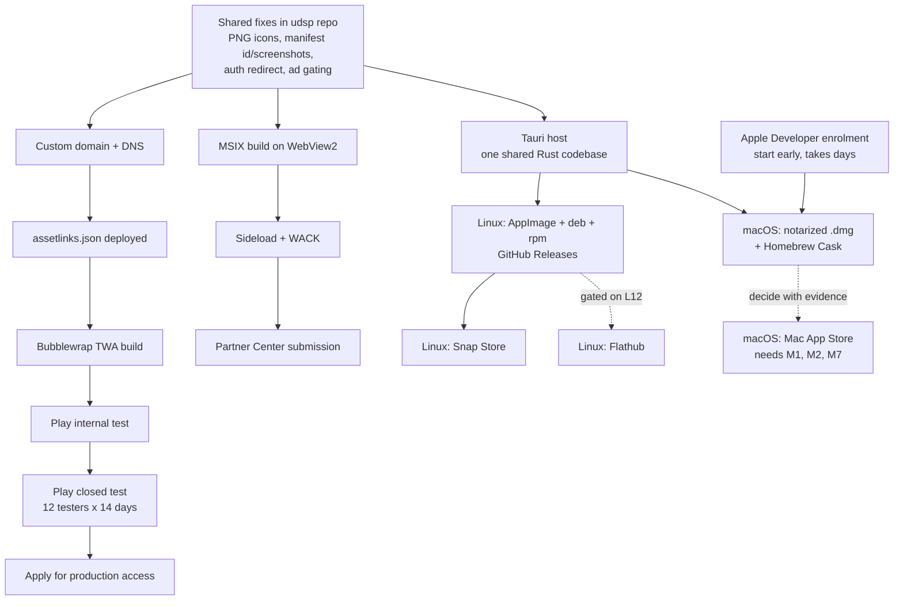

# udsp — Multi-Platform Store Packaging Analysis

Analysis workspace for shipping the **Top Words — Trainer** web app
(<https://udsp.vercel.app>, source: <https://github.com/qlupala9p/udsp>) to the
**Google Play Store**, the **Microsoft Store**, **Linux desktops**, and
**macOS**.

Nothing in the `udsp` repository is modified by this analysis. Most fixes
identified here are described as changes to be made **in the `udsp` repo**,
because that is where the manifest, service worker, and auth client live.

The Windows track has since moved past analysis: `windows/src/` holds a working
WPF + WebView2 host. The layout defect recorded as W7 was found by measuring
that running app and **fixed there**, in
`windows/src/TopWords.Windows/Scripts/bootstrap.js`. That file is plain,
platform-agnostic JavaScript and is reused **unchanged** by the Linux and macOS
tracks.

---

## Documents

| Track | Document | Purpose |
| --- | --- | --- |
| Android | [01-app-analysis.md](android/01-app-analysis.md) | Per-feature Android verdict + TWA readiness scorecard |
| Android | [02-packaging-strategy.md](android/02-packaging-strategy.md) | TWA vs Capacitor vs native — decision matrix |
| Android | [03-blockers-and-fixes.md](android/03-blockers-and-fixes.md) | Ordered blocker list with concrete fixes |
| Android | [04-release-runbook.md](android/04-release-runbook.md) | Build, sign, test, and Play Console submission |
| Windows | [01-app-analysis.md](windows/01-app-analysis.md) | Per-feature desktop verdict + MSIX readiness scorecard |
| Windows | [02-packaging-strategy.md](windows/02-packaging-strategy.md) | PWABuilder MSIX vs Electron vs WinUI — decision matrix |
| Windows | [03-blockers-and-fixes.md](windows/03-blockers-and-fixes.md) | Ordered blocker list with concrete fixes |
| Windows | [04-release-runbook.md](windows/04-release-runbook.md) | Package, certify, and Partner Center submission |
| Linux | [01-app-analysis.md](linux/01-app-analysis.md) | WebKitGTK verdict + desktop integration scorecard |
| Linux | [02-packaging-strategy.md](linux/02-packaging-strategy.md) | AppImage vs Flathub vs Snap — decision matrix |
| Linux | [03-blockers-and-fixes.md](linux/03-blockers-and-fixes.md) | Ordered blocker list with concrete fixes |
| Linux | [04-release-runbook.md](linux/04-release-runbook.md) | Build, package, and publish to GitHub Releases |
| macOS | [01-app-analysis.md](macosx/01-app-analysis.md) | WKWebView verdict + Mac App Store readiness scorecard |
| macOS | [02-packaging-strategy.md](macosx/02-packaging-strategy.md) | Notarized `.dmg` vs Mac App Store — decision matrix |
| macOS | [03-blockers-and-fixes.md](macosx/03-blockers-and-fixes.md) | Ordered blocker list, split by distribution channel |
| macOS | [04-release-runbook.md](macosx/04-release-runbook.md) | Build, sign, notarize, staple, and publish |

---

## Executive summary

The app is **already a competent PWA** — it has a real, well-designed service
worker with offline support, an installable manifest, and 28 distinct study
screens. It is **not** a thin content wrapper, which is the single biggest
predictor of store rejection.

The recommended path on every platform is therefore **wrap the existing PWA**,
not rewrite:

- **Android** → Trusted Web Activity (TWA), built with Bubblewrap
- **Windows** → MSIX packaged web app on WebView2
- **Linux** → Tauri host, shipped as an AppImage plus `.deb` and `.rpm`
- **macOS** → the **same** Tauri host, shipped as a notarized `.dmg`

This keeps **one codebase**. The work is not "port the app" — it is "close a
specific set of readiness gaps in the `udsp` repo, then wrap."

### The desktop tracks split into two very different problems

Windows and the *ungated* Linux and macOS channels are engineering problems.
The **curated** stores are policy problems, and both of them object to this
class of app on principle:

- **Flathub**: *"Simple web wrapper applications that embed local or remote
  content in a web engine without providing significant polish, functionality,
  or meaningful desktop integration will not be accepted."*
- **Apple 4.2**: *"Your app should include features, content, and UI that
  elevate it beyond a repackaged website."*

Both objections have the same answer — real native integration — so the work is
built once and spent twice. But neither is a checklist item with a predictable
outcome, so **both tracks lead with the ungated channel** (AppImage, notarized
`.dmg`) and treat the store as a later, evidence-driven decision.

### The four shared hard blockers

| # | Blocker | Where | Impact |
| --- | --- | --- | --- |
| 1 | Manifest ships **only `icon.svg`** | `site.webmanifest` | Every platform needs raster icons. Blocks **all four**. |
| 2 | `/.well-known/assetlinks.json` returns **404** | Vercel / repo root | TWA shows a browser URL bar and fails Play review. Blocks **Android**. |
| 3 | `signInWithPopup` used for Google sign-in | `firebase-client.js` → `signIn()` | Breaks in Android Custom Tabs, unreliable in WebView2, and **fails outright** in WebKitGTK and `WKWebView`. Blocks **all four**. |
| 4 | Google AdSense runs on every page | `<head>` of all HTML pages | AdSense is a *website* product used inside an app surface. Account-level risk, not just review risk. |

### Platform-specific hard blockers

These have no equivalent on the other tracks and are the main reason the two
new tracks are not simply "the Windows work again":

| Blocker | Track | Impact |
| --- | --- | --- |
| **`speechSynthesis` often has no voices** | Linux ([§L5](linux/03-blockers-and-fixes.md)) | The Listen button, `listening.html`, and `dictation.html` fail **silently** — `speak()` resolves and no audio plays. Needs a native `speech-dispatcher` bridge. |
| **Sign in with Apple required** | macOS ([§M1](macosx/03-blockers-and-fixes.md)) | Guideline 4.8: offering Google Sign-In obliges an equivalent alternative. Spans Apple Developer, Firebase, and `firebase-client.js`. **Mac App Store only.** |
| **No `.desktop` or AppStream metadata** | Linux ([§L1](linux/03-blockers-and-fixes.md)) | Without them the app has no launcher entry and is invisible to every software centre. |
| **2.4.5(iv)/(vii) forbid remote code and non-store updates** | macOS ([§M7](macosx/03-blockers-and-fixes.md)) | Forces the App Store build to bundle content locally, which also makes every content change a reviewed submission. **Mac App Store only.** |
| **Flathub bans AI-generated code and AI-opened PRs** | Linux ([§L12](linux/03-blockers-and-fixes.md)) | Directly conflicts with how this project was produced. Decide before investing in a Flatpak manifest. |

Full detail and remediation steps are in each track's `03-blockers-and-fixes.md`.

---

## Shared source-app inventory

Findings below were gathered by reading the `udsp` repository at `main` and
probing the live site. They apply to both tracks and are not repeated in full in
the per-track documents.

### Architecture

- **Turkish-first vocabulary trainer** for English, German, French, Italian,
  Spanish, and Portuguese, covering CEFR levels A1–C2.
- **100% static site.** No build step, no bundler, no framework. `package.json`
  declares only `npx serve .` for both `dev` and `start`.
- Plain global `<script defer>` architecture. Each page loads `shared.js` plus a
  single per-mode script; there are **no ES modules** and no import graph.
- **~28 HTML pages**: `index` (flashcards), `home`, `quiz`, `games`, `hangman`,
  `matrix`, `memory`, `scramble`, `sentencescramble`, `speedround`, `survival`,
  `truefalse`, `wordmorph`, `wordrace`, `clozetest`, `dictation`, `listening`,
  `readingcomprehension`, `wordlist`, `stats`, `history`, `profile`, `help`,
  `about`, `privacy`, `terms`.
- **`data/`** holds 50+ JavaScript files totalling **~36 MB** (figure stated in
  the `sw.js` header comment): `wordsa1`–`wordsc2` × 6 languages,
  `phrasalverbsen` / `phrasalverbsfr`, `partikelverbde`, `toefl`,
  `synant{de,en,fr}`, and several `readingcomp*` sets.
- **`scripts/`** contains Python tooling used to generate the word data. It is
  build-time only and is irrelevant to packaging.

### State and persistence

All user progress lives in `localStorage` under `udsp_*` keys:

`udsp_known_v1`, `udsp_fav_v1`, `udsp_streak_v1`, `udsp_daily_v1`,
`udsp_resume_v2`, `udsp_history_v1`, `udsp_srs_v1`, `udsp_stats_v1`,
`udsp_theme_v1`, `udsp_start_page_v1`, `udsp_autosave_v1`,
`udsp_profile_linked_v1`, plus per-game best-score prefixes
(`udsp_best_scores_`, `udsp_matrix_best_`, `udsp_memory_best_`,
`udsp_speedround_best_`, `udsp_survival_best_`, `udsp_truefalse_best_`,
`udsp_wordrace_best_`).

This matters for packaging: **`localStorage` is scoped to the origin**, so a TWA
and the mobile web site share storage, while an MSIX packaged app and Electron
each get their own isolated store. See each track's analysis for consequences.

### Firebase

- `firebase-config.js` exposes the public web config for project `udsp-9fedc`.
  These values are not secrets; access control is enforced by
  `firestore.rules`.
- `firebase-client.js` uses the **compat SDK** (global `firebase.*`, no bundler)
  and is loaded **only on `profile.html`**.
- **Google is the only sign-in provider.**
- One Firestore document per user at `users/{uid}`, mirroring the same
  `localStorage` keys listed above. Autosave pushes local state every 60 s while
  `profile.html` is open.
- Account deletion is **already implemented** (`deleteAccountAndProfile`), which
  satisfies a Play requirement most apps fail on.

### Service worker (`sw.js`)

Already strong, and a significant asset for store review:

- `CACHE_VERSION = "v1"`; caches `udsp-shell-v1` and `udsp-data-v1`.
- **Three lanes:**
  1. `/data/*` — cache-first, with a background refresh once the cached copy
     exceeds 24 h. Steady-state visits make zero data requests.
  2. Navigations — network-first with cache fallback, plus an inline
     `OFFLINE_HTML` response as a last resort.
  3. Static assets (`css|js|svg|png|ico|webmanifest|woff2?`) —
     stale-while-revalidate.
- Deliberately **skips all cross-origin requests** (AdSense, Firebase, fonts) and
  any request carrying a `Range` header.
- `SHELL_ASSETS` precaches only: `/`, `/index.html`, `/home.html`, `/styles.css`,
  `/shared.js`, `/flashcards.js`, `/home.js`, `/moresheet.js`, `/icon.svg`,
  `/site.webmanifest`. Everything else is cached on first visit.
- Install uses per-asset `cache.add()` with a swallowed catch rather than
  `addAll()`, so one 404 degrades instead of aborting the whole install.

### Manifest (`site.webmanifest`)

| Field | Value | Verdict |
| --- | --- | --- |
| `name` / `short_name` / `description` | Present, Turkish | Pass |
| `lang` | `tr` | Pass |
| `dir` | `ltr` | Pass |
| `start_url` | `/` | Pass |
| `scope` | `/` | Pass |
| `display` | `standalone` | Pass |
| `background_color` / `theme_color` | `#0f172a` | Pass |
| `categories` | `education`, `productivity`, `books` | Pass |
| `orientation` | `portrait-primary` | **Problem** — hostile to desktop and tablet |
| `icons` | **`icon.svg` only** (`sizes: "any"`, `image/svg+xml`) | **Blocker** |
| `id` | Missing | Should add |
| `screenshots` | Missing | Should add |
| `shortcuts` | Missing | Nice to have |
| `display_override` | Missing | Nice to have |

### Hosting (`vercel.json`)

- `cleanUrls: true`, `trailingSlash: false` — `/quiz` and `/quiz.html` both
  resolve. The service worker explicitly accounts for this in its navigation
  fallback.
- Redirects: `/review.html` and `/review` → `/` (permanent).
- Global headers: `Cache-Control: public, max-age=0, must-revalidate`,
  `X-Content-Type-Options: nosniff`, `X-Frame-Options: SAMEORIGIN`,
  `Referrer-Policy: strict-origin-when-cross-origin`.
- `/data/*`: `Cache-Control: public, max-age=3600, stale-while-revalidate=86400`.
- **`https://udsp.vercel.app/.well-known/assetlinks.json` returns HTTP 404.**

### Advertising

- Google AdSense (`ca-pub-4464915775427405`) is loaded from the `<head>` of every
  HTML page.
- `ads.txt` is present at the site root.

---

## Decision log

| # | Decision | Choice | Rationale |
| --- | --- | --- | --- |
| D1 | Wrapper vs bundled runtime | **Wrapper** (TWA + MSIX) | The app is already a strong PWA. One codebase, no fork. Capacitor/Electron documented as fallbacks if offline-from-install or native ads become requirements. |
| D2 | Ads inside packaged builds | **Strip for v1** via app-context detection | Avoids putting the AdSense account that funds the website at risk. AdMob migration is a follow-up, Android-only, and does nothing for Windows. |
| D3 | Custom domain | **Register before first Play submission** | The TWA origin is compiled into the APK and verified via Digital Asset Links. Moving off `udsp.vercel.app` later forces an app update and re-verification. |
| D4 | Scope of this repo | **Analysis, plus the Windows host** | Analysis for all four tracks. The Windows host in `windows/src/` was built afterwards and is the only code here. No `udsp` repo changes have been made. |
| D5 | Out of scope | iOS / iPadOS, Amazon Appstore, ChromeOS, monetization strategy beyond the ad-policy blocker | Not requested. macOS **is** now in scope; iOS is not. |
| D6 | Linux and macOS scope | **Analysis documents only** | Mirrors how the Android and Windows tracks began. Implementation is a follow-up. |
| D7 | macOS channel | **Direct notarized `.dmg` first**; Mac App Store as a stretch goal | The App Store alone forces Sign in with Apple (M1), a Guideline 4.2 defence (M2), and locally-bundled content (M7) — and under 2.4.5(vii) it permanently gives up review-free content updates. The direct path avoids all of it and still produces a signed, Gatekeeper-clean install. Homebrew Cask added as a free amplifier. |
| D8 | Linux channel | **AppImage + `.deb` / `.rpm` on GitHub Releases first**; Flathub as a stretch goal | Flathub has three real obstacles — the anti-wrapper rule, the Generative AI policy, and the English-localisation requirement. The ungated channel has none and ships immediately. Snap Store is the recommended second step. |
| D9 | Linux + macOS runtime | **Tauri v2, one shared Rust codebase** | `WKWebView` on macOS (which also satisfies Apple 2.5.6) and WebKitGTK on Linux — the same engine family, so WebKit is tested once. ~10–15 MB binaries versus ~150 MB for Electron, with no Chromium CVE obligation. `bootstrap.js` ports over unchanged. |
| D10 | Build hardware | **Assume Windows-only; target GitHub Actions** | No Mac or Linux machine is available. Both runbooks are written against `macos-latest` and `ubuntu-latest` runners, free for public repos. macOS signing genuinely cannot be done from Windows. |

> **D7–D10 were made without user input**, in response to an explicit instruction
> to proceed autonomously. They are the decisions most worth reviewing.

---

## Suggested sequencing

The shared fixes are the critical path — all four tracks are blocked behind the
same manifest and auth work. After that the tracks diverge sharply in cost.

**Windows first.** It has no equivalent of the 12-tester / 14-day Play gate and
no signing identity to obtain, so it reaches a store soonest and validates the
shared manifest, auth, and ad-gating fixes against a real review.

**Linux second.** It is the cheapest track outright — no account, no fee, no
signing, no review queue — and it is where the shared Tauri host should be
debugged, in the fastest possible loop.

**macOS last.** It shares its codebase with Linux, so it inherits proven work,
but it carries the only recurring fee, the longest lead time, and the only
human reviewer. Start the Apple Developer enrolment early regardless; it is the
one item that cannot be accelerated once it becomes urgent.
