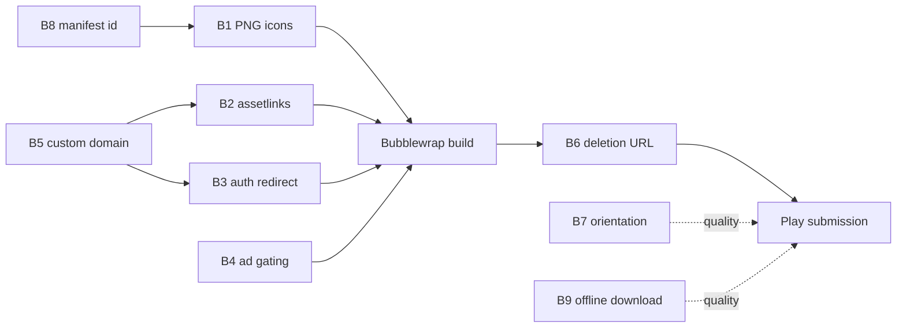

# Android — Blockers and Fixes

Ordered remediation list. Every item names a **concrete file and symbol in the
`qlupala9p/udsp` repository**, not a generic recommendation.

Severity key:

- **Blocker** — cannot produce a submittable, address-bar-free TWA without it.
- **High** — will fail review, or will fail for a large share of users.
- **Medium** — quality or policy hygiene; fix before public launch.
- **Low** — polish.

| ID | Severity | Item | File |
| --- | --- | --- | --- |
| B1 | Blocker | PNG icons missing from manifest | `site.webmanifest` |
| B2 | Blocker | `assetlinks.json` returns 404 | new file + `vercel.json` |
| B3 | Blocker | `signInWithPopup` breaks in Custom Tabs | `firebase-client.js` |
| B4 | Blocker | AdSense inside a packaged app | all `*.html`, new `shared.js` helper |
| B5 | High | Origin is `udsp.vercel.app` | Vercel project settings |
| B6 | High | No web URL for account-deletion requests | `privacy.html` / `terms.html` |
| B7 | Medium | `orientation: portrait-primary` | `site.webmanifest` |
| B8 | Medium | Manifest `id` missing | `site.webmanifest` |
| B9 | Medium | 36 MB cold-start data download | `sw.js`, new UI affordance |
| B10 | Low | `screenshots` and `shortcuts` missing | `site.webmanifest` |
| B11 | Low | Service-worker shell does not cover the TWA entry path | `sw.js` |

---

## B1 — Manifest ships only an SVG icon *(Blocker)*

**File:** `site.webmanifest`

**Current:**

```json
"icons": [
  { "src": "icon.svg", "sizes": "any", "type": "image/svg+xml", "purpose": "any maskable" }
]
```

**Why it blocks:** Bubblewrap reads the manifest to generate launcher icons,
the notification icon, and the splash screen. It requires a **raster** icon of
at least **512×512**. An SVG-only `icons` array causes generation to fail.
`purpose: "any maskable"` on a single entry is also poor practice — a maskable
icon needs a ~20% safe-zone margin, which makes it look wrong when used as a
plain `any` icon.

**Fix:** render `icon.svg` to PNG at several sizes, commit them to the repo
root, and split the purposes:

```json
"icons": [
  { "src": "icon.svg",             "sizes": "any",     "type": "image/svg+xml", "purpose": "any" },
  { "src": "icon-192.png",         "sizes": "192x192", "type": "image/png",     "purpose": "any" },
  { "src": "icon-512.png",         "sizes": "512x512", "type": "image/png",     "purpose": "any" },
  { "src": "icon-maskable-512.png","sizes": "512x512", "type": "image/png",     "purpose": "maskable" }
]
```

`icon-maskable-512.png` must be a **separate artwork** with the logo inset
inside the safe zone against a `#0f172a` background, not the same file reused.

Also add matching `<link rel="apple-touch-icon" href="icon-192.png">` — the
current `apple-touch-icon` points at the SVG, which iOS ignores.

**Verify:** `npx pwa-asset-generator` or the PWABuilder Image Generator, then
confirm Bubblewrap no longer warns during `bubblewrap init`.

---

## B2 — `assetlinks.json` returns 404 *(Blocker)*

**Files:** new `.well-known/assetlinks.json`; check `vercel.json`

**Why it blocks:** Digital Asset Links is what proves the app and the website
are the same party. Without a valid, reachable statement file the TWA
**degrades to a Custom Tab with a visible URL bar** — which both looks broken
and reads to a reviewer as a webview wrapper.

**Fix:** create `.well-known/assetlinks.json` at the repo root:

```json
[
  {
    "relation": ["delegate_permission/common.handle_all_urls"],
    "target": {
      "namespace": "android_app",
      "package_name": "com.example.topwords",
      "sha256_cert_fingerprints": [
        "UPLOAD_KEY_SHA256_FINGERPRINT",
        "PLAY_APP_SIGNING_SHA256_FINGERPRINT"
      ]
    }
  }
]
```

**The single most common mistake here is listing only one fingerprint.** With
Play App Signing enabled, Google re-signs the bundle with a key you do not hold.
Locally built and internally tested APKs carry the **upload key**; anything
distributed through Play carries the **Play app signing key**. Both must be
present or the app works in testing and shows a URL bar in production.

Retrieve the Play signing fingerprint from
**Play Console → Test and release → Setup → App integrity → App signing**.

**Vercel-specific checks:**

- `cleanUrls: true` rewrites extensionless paths. Confirm it does not interfere
  with `/.well-known/assetlinks.json`. Verify after deploy, do not assume.
- The response must be `Content-Type: application/json` and HTTP 200 with no
  redirect. A 301 to a trailing-slash variant will fail verification.
- The global `Cache-Control: public, max-age=0, must-revalidate` header is fine.

**Verify:**

```powershell
curl.exe -i https://<your-domain>/.well-known/assetlinks.json
```

then the authoritative check:

```
https://digitalassetlinks.googleapis.com/v1/statements:list
  ?source.web.site=https://<your-domain>
  &relation=delegate_permission/common.handle_all_urls
```

A successful response contains your package name and **no** `errorCode`.

---

## B3 — `signInWithPopup` breaks in a TWA *(Blocker)*

**File:** `firebase-client.js`, function `signIn(providerId)`

**Current:**

```js
function signIn(providerId) {
  var build = PROVIDERS[providerId];
  if (!build) return Promise.reject(new Error("Unknown provider: " + providerId));
  return auth.signInWithPopup(build()).then(function (result) { /* ... */ });
}
```

**Why it blocks:** `signInWithPopup` opens a secondary window and relies on
`postMessage` back to the opener. Inside an Android Custom Tab there is no
usable popup surface; the call either silently never resolves or rejects with
`auth/popup-blocked`. Sign-in is the entry point to the entire cloud-sync
feature, so this takes out `profile.html` completely.

**Fix:** detect the standalone app context and branch to the redirect flow,
keeping popup for desktop web where it is the better experience.

1. Add a context helper (see B4 — the same helper serves both fixes).
2. Branch in `signIn`:

```js
function signIn(providerId) {
  var build = PROVIDERS[providerId];
  if (!build) return Promise.reject(new Error("Unknown provider: " + providerId));
  if (window.TWApp && window.TWApp.isPackaged()) {
    return auth.signInWithRedirect(build());   // resolves after the redirect
  }
  return auth.signInWithPopup(build()).then(afterSignIn);
}
```

3. **Critical:** the post-sign-in work currently lives inside the
   `signInWithPopup(...).then(...)` callback — it seeds or adopts the Firestore
   profile document. With a redirect, that callback never runs on this page
   load. Extract it into a named `afterSignIn(result)` function and also call it
   from a `getRedirectResult` handler that runs at module init:

```js
auth.getRedirectResult()
  .then(function (result) { if (result && result.user) return afterSignIn(result); })
  .catch(function (e) { /* surface to profile.js */ });
```

Without this step the user signs in successfully and their cloud profile is
never created — a silent data-loss bug that only manifests in the packaged app.

4. Add the production origin to **Firebase Console → Authentication → Settings
   → Authorized domains**.

**Also note:** Firebase's redirect flow historically routed through
`<project>.firebaseapp.com`, which breaks under third-party-cookie restrictions.
Configure a **custom auth domain** on your own origin so the redirect stays
first-party. This interacts with B5 — do both together.

**Verify:** install the internal-test build on a real device, sign in, force-quit,
reopen, and confirm the session persists and `users/{uid}` exists in Firestore.

---

## B4 — AdSense inside a packaged app *(Blocker)*

**Files:** `<head>` of all `*.html`; new helper in `shared.js`

**Current:** every page loads

```html
<script async
  src="https://pagead2.googlesyndication.com/pagead/js/adsbygoogle.js?client=ca-pub-4464915775427405"
  crossorigin="anonymous"></script>
```

**Why it blocks:** per decision **D2**, ads are stripped from packaged builds
for v1. The rationale is in [01-app-analysis.md](01-app-analysis.md) §5 — the
downside of an AdSense policy action is account-wide, not app-scoped.

**Fix:** add an app-context detector and load the AdSense script conditionally
instead of statically.

Add to `shared.js` (loaded on every page):

```js
window.TWApp = (function () {
  function isTWA() {
    // Chrome sets this referrer for documents launched from a TWA.
    return document.referrer.indexOf("android-app://") === 0;
  }
  function isStandalone() {
    return window.matchMedia("(display-mode: standalone)").matches ||
           window.navigator.standalone === true;
  }
  function isMsix() {
    return / MSAppHost\//.test(navigator.userAgent) ||
           location.protocol === "ms-appx-web:";
  }
  var packaged = isTWA() || isMsix() || isStandalone();
  return {
    isPackaged: function () { return packaged; },
    isTWA: isTWA,
    isMsix: isMsix
  };
})();
```

Then replace the static `<script>` in each page's `<head>` with an injected
load, guarded by `TWApp.isPackaged()`.

**Two caveats, both important:**

1. `document.referrer` is only `android-app://…` on the **first** document of
   the TWA session. Subsequent same-origin navigations lose it. Persist the
   verdict on first detection:
   `sessionStorage.setItem("udsp_packaged_v1", "1")` and read it back in
   `TWApp`. Without this, ads would appear from page two onward — the worst
   possible outcome, because it is invisible in casual testing.
2. `display-mode: standalone` is also true for a **browser-installed PWA** on
   the open web. That is arguably fine (an installed PWA is still the website),
   but be deliberate: if you want ads to keep running for browser-installed
   PWAs, gate on `isTWA() || isMsix()` only.

Also remove or gate the AdSense-related entries so the Play Console **"Contains
ads"** declaration matches what the build actually does.

**Verify:** in the internal-test build, open DevTools remote debugging
(`chrome://inspect`) and confirm no request to `pagead2.googlesyndication.com`
on **any** page, including after several in-app navigations.

---

## B5 — Origin is `udsp.vercel.app` *(High)*

**Where:** Vercel project settings; then every absolute URL in the repo.

**Why it matters:** the origin is compiled into the APK and verified via asset
links. Changing it post-launch requires an app update, and every user who has
not updated points at the old origin. Because `localStorage` is origin-scoped,
those users appear to lose all progress.

`.vercel.app` is on the Public Suffix List, so per-origin asset links do work
technically. The problems are practical: it is unbrandable, it signals a
hobby deployment to reviewers, and it is not portable if hosting changes.

**Fix:** register a domain, attach it in Vercel, make it canonical, and only
then build the TWA. Update:

- `<link rel="canonical">` in every HTML page
- `og:url`, `og:image`, `twitter:image` meta tags
- the `@id` and `url` fields in the JSON-LD `WebApplication` block
- `sitemap.xml`, `robots.txt`
- Firebase authorized domains, and the custom auth domain from B3

Keep `udsp.vercel.app` as a 308 redirect for SEO continuity.

**This is the single highest-leverage sequencing decision in the project.** It
is cheap now and expensive after launch.

---

## B6 — No web URL for account-deletion requests *(High)*

**Files:** `privacy.html` or `terms.html`

**Why it matters:** Play requires apps offering account creation to provide a
**publicly reachable web URL** where users can request account and data
deletion, in addition to any in-app path. The in-app path already exists
(`deleteAccountAndProfile()` in `firebase-client.js`) — the web URL does not.

**Fix:** add a clearly-titled section, for example
`https://<domain>/privacy#account-deletion`, that states what is deleted
(the Firestore `users/{uid}` document and the Firebase Auth account), what is
retained and for how long, and how to request deletion without signing in.
Submit that exact URL in the Play Console Data Safety form.

---

## B7 — `orientation: portrait-primary` *(Medium)*

**File:** `site.webmanifest`

Locks the app to portrait. Play's tablet and large-screen quality guidelines
expect landscape support, and large-screen quality affects Play Store
surfacing.

**Fix:** change to `"orientation": "any"` and verify the layout at 800×1280 and
1280×800. The header uses a `selectors-row` plus a `bottom-nav` inside
`.brand`, which is a mobile-first structure — check it does not stretch badly in
landscape before flipping this.

If the layout genuinely cannot support landscape, leaving it portrait is
acceptable for phones; it is a quality deduction, not a rejection.

---

## B8 — Manifest `id` missing *(Medium)*

**File:** `site.webmanifest`

Without an explicit `id`, app identity is derived from `start_url`. Any future
change to `start_url` is then treated as a **different app**, orphaning
installs.

**Fix:** add `"id": "/"` (or an absolute URL on the final domain). Do this
**before** first release — changing `id` later has the same orphaning effect it
is meant to prevent.

---

## B9 — 36 MB cold-start data download *(Medium)*

**Files:** `sw.js`, plus a new UI affordance

`SHELL_ASSETS` precaches only the shell. All word data is fetched on demand. A
fresh install therefore downloads word lists during the first study session.

**Fix (recommended):** add an explicit **"Çevrimdışı için indir · Download for
offline"** control, most naturally on `home.html` or `profile.html`, that
posts a message to the service worker to warm `udsp-data-v1` for the currently
selected language, with a visible size estimate and progress.

**Do not** simply add all of `data/` to `SHELL_ASSETS` — that would force every
web visitor to pay 36 MB on first paint, badly regressing the website to fix an
app-only problem.

---

## B10 — `screenshots` and `shortcuts` missing *(Low)*

**File:** `site.webmanifest`

Neither is required for TWA function. `screenshots` improves the install
dialog and raises the PWABuilder score; `shortcuts` adds launcher long-press
entries. Natural shortcuts here: Flashcards (`/index.html`), Quiz
(`/quiz.html`), Games (`/games.html`).

Note the `screenshots` added here are for the **manifest**; Play Store listing
screenshots are a separate asset set with different requirements — see
[04-release-runbook.md](04-release-runbook.md).

---

## B11 — Service-worker shell and the TWA entry path *(Low)*

**File:** `sw.js`

`SHELL_ASSETS` lists `/` and `/index.html`. The TWA launches at `start_url`,
which is `/`, so cold-start offline works. Two refinements:

- Add `/quiz.html`, `/games.html`, and `/wordlist.html` to `SHELL_ASSETS`.
  These are the three primary bottom-nav destinations, and a user who installs
  the app and immediately goes offline currently gets the `OFFLINE_HTML`
  placeholder on all of them.
- Bump `CACHE_VERSION` from `"v1"` when the manifest icon changes land, so
  existing clients drop the stale `site.webmanifest` and `icon.svg` entries from
  `udsp-shell-v1`.

---

## Suggested fix order



B5 gates B2 and B3, so **do the domain first**. B8 should land in the same
manifest edit as B1 to avoid two cache-busting deploys.
