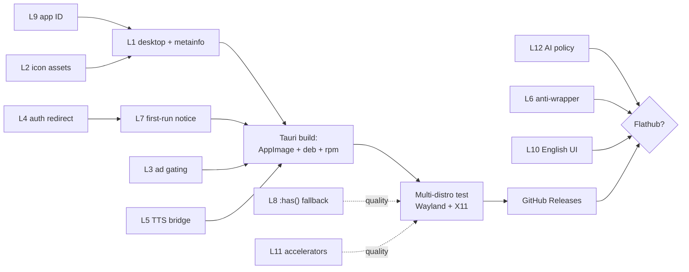

# Linux — Blockers and Fixes

Ordered remediation list. Every item names a **concrete file and symbol in the
`qlupala9p/udsp` repository**, a file the Linux host must add, or a specific
Flathub / Snap Store action.

Severity key:

- **Blocker** — cannot produce a distributable, correctly-integrated Linux app
  without it.
- **High** — will fail for a large share of users, or blocks a store channel.
- **Medium** — quality; fix before public launch.
- **Low** — polish, or a policy question to resolve rather than code to write.

| ID | Severity | Item | File / location |
| --- | --- | --- | --- |
| L1 | Blocker | No `.desktop` entry or AppStream MetaInfo | new files in the Linux host |
| L2 | Blocker | Icon theme assets missing | `site.webmanifest` + new PNGs |
| L3 | Blocker | AdSense inside a packaged app | all `*.html`, `shared.js` |
| L4 | Blocker | `signInWithPopup` has no handler in WebKitGTK | `firebase-client.js` |
| L5 | High | `speechSynthesis` has no voices | Linux host + `shared.js` |
| L6 | High | Flathub rejects web wrappers | packaging + host features |
| L7 | High | Storage isolation and Firebase authorized domains | `bootstrap.js`, Firebase Console |
| L8 | Medium | `:has()` unsupported on older WebKitGTK | `bootstrap.js` |
| L9 | Medium | No reverse-DNS application ID | host config + MetaInfo |
| L10 | Medium | Flathub requires complete English localisation | all `*.html` |
| L11 | Medium | No keyboard accelerators; `orientation` metadata | Linux host, `site.webmanifest` |
| L12 | Low | Flathub Generative AI policy conflict | process, not code |

> **L2, L3, L4, and part of L11 are shared with the Android and Windows
> tracks.** Fix each once, in the `udsp` repo, and every platform benefits. See
> [../android/03-blockers-and-fixes.md](../android/03-blockers-and-fixes.md)
> §B1, §B3, §B4, §B7 and
> [../windows/03-blockers-and-fixes.md](../windows/03-blockers-and-fixes.md)
> §W1, §W3, §W4, §W8 for the full treatment; only the Linux-specific deltas are
> given below.

---

## L1 — No `.desktop` entry or AppStream MetaInfo *(Blocker)*

**Files:** two new files shipped by the Linux host

Without a `.desktop` file the application has no launcher entry, no dock icon,
no window-to-icon association, and no MIME handling. It exists as a binary and
nothing else. Without an AppStream MetaInfo file it is invisible to GNOME
Software, KDE Discover, and every distribution software centre, and it cannot
be submitted to Flathub or Snap at all.

**`io.github.qlupala9p.udsp.desktop`:**

```ini
[Desktop Entry]
Type=Application
Name=Top Words
Comment=Vocabulary trainer for English, German, French, Italian, Spanish, Portuguese
Exec=topwords %U
Icon=io.github.qlupala9p.udsp
Terminal=false
Categories=Education;Languages;
Keywords=vocabulary;language;flashcards;YDS;TOEFL;
StartupWMClass=topwords
```

`StartupWMClass` must match the window class the host actually sets, or the
running window will appear as a second, unnamed icon in the dock. This is the
single most commonly-botched line in the file.

**`io.github.qlupala9p.udsp.metainfo.xml`** needs at minimum `<id>`, `<name>`,
`<summary>`, `<description>`, `<launchable type="desktop-id">`,
`<metadata_license>`, `<project_license>`, `<url type="homepage">`,
`<screenshots>`, `<releases>`, and `<content_rating type="oars-1.1">`.

Validate both before shipping:

```bash
desktop-file-validate io.github.qlupala9p.udsp.desktop
appstreamcli validate io.github.qlupala9p.udsp.metainfo.xml
```

Flathub additionally runs `flatpak-builder-lint`, which is stricter than
`appstreamcli`. If Flathub is ever a target, run it early — retrofitting
metadata to satisfy it is tedious.

**Note on `<releases>`:** it must be maintained per release, and Flathub
validation fails on a stale or missing entry. Generate it in CI from the git
tag rather than hand-editing.

**Verified 2026-08-01 (Debian 13, WSL).** Both files now exist under
`linux/packaging/`. `desktop-file-validate` on the rendered template passes
and `appstreamcli validate` reports **no errors**. Two findings came out of
that run:

1. **CRLF line endings are a hard error.** Both files were checked in from
   Windows with CRLF, and `desktop-file-validate` refuses them outright —
   *"file contains at least one line ending with a carriage return"*. Tauri
   copies `desktopTemplate` into the `.deb`/`.rpm` verbatim, so the broken
   file would have shipped. Fixed by converting both to LF and adding a root
   `.gitattributes` that pins `*.sh`, `*.hbs`, `*.desktop` and `*.metainfo.xml`
   to `eol=lf` so the next Windows checkout cannot silently undo it.
2. **The three `<screenshot>` URLs 404.** They point at
   `raw.githubusercontent.com/qlupala9p/udsp/main/docs/screenshots/{flashcards,quiz,wordlist}.png`,
   which do not exist yet. `appstreamcli` downgrades this to a warning, but
   `flatpak-builder-lint` treats missing screenshots as fatal, so the images
   have to land in the udsp repo before any store submission.

---

## L2 — Icon theme assets missing *(Blocker)*

**File:** `site.webmanifest`, plus new PNG assets

Shared with Android B1 and Windows W1. The manifest declares only `icon.svg`.

Linux wants the **hicolor icon theme** layout — a scalable SVG plus sized PNG
rasters, because not every consumer renders SVG:

```
share/icons/hicolor/scalable/apps/io.github.qlupala9p.udsp.svg
share/icons/hicolor/{16,32,48,64,128,256,512}x{...}/apps/io.github.qlupala9p.udsp.png
```

The good news: the PNG raster work is a **subset of what Windows already
needs**, and `icon.svg` is already a clean vector source. The Windows track's
generator produced these sizes as part of the same matrix — reuse those
outputs rather than regenerating.

Filenames must equal the application ID from §L9, or the `.desktop` file's
`Icon=` key will not resolve and the app shows a generic placeholder.

**Partially resolved 2026-08-01.** This blocked the build, not just the
polish: `tauri::generate_context!()` reads `bundle.icon` at *compile* time and
the crate would not build at all — `proc macro panicked … failed to open icon
icons/32x32.png`. The four PNGs Tauri requires (`32x32`, `128x128`,
`128x128@2x`, `icon.png`) are now generated from `linux/host/icons/icon.svg`
and committed. Note that this SVG is **not** byte-identical to
`windows/assets/source/icon.svg`, so the Windows raster outputs cannot simply
be copied over as the earlier note suggested.

Regenerating them needs an SVG rasteriser, and a stock Debian 13 image has
none (`rsvg-convert`, `inkscape` and ImageMagick are all absent). Either add
`librsvg2-bin` to the build image:

```bash
sudo apt-get install -y librsvg2-bin
for s in 32 128 256 512; do rsvg-convert -w $s -h $s icons/icon.svg -o icons/${s}.png; done
```

or run `cargo tauri icon icons/icon.svg`, which does the whole matrix.

Still outstanding for this blocker: the full **hicolor theme** layout above,
which is what makes `Icon=io.github.qlupala9p.udsp` resolve. Tauri's four
bundle icons are not the same thing.

---

## L3 — AdSense inside a packaged app *(Blocker)*

**Files:** all `*.html`, `shared.js`

Shared with Android B4 and Windows W4; the reasoning is identical and is not
repeated here. AdSense is a *website* product being served inside an
application surface, which risks the AdSense account that funds the website —
a far worse outcome than a rejected app.

**Linux-specific note:** the risk is *higher* here than on Windows, not lower.
An AppImage distributed outside any store still displays ads inside a native
window, and there is no store review to catch it first. Absence of a gatekeeper
removes the warning, not the violation.

The Windows host already blocks the ad origins at the network layer, returning
HTTP 204 for requests matching `AppConfig.BlockedResourcePatterns`. Port the
same list to the Tauri request interceptor. That is a belt-and-braces measure —
it does not remove the need for the upstream app-context gate, because the
scripts are still referenced in the HTML.

---

## L4 — `signInWithPopup` has no handler in WebKitGTK *(Blocker)*

**File:** `firebase-client.js` → `signIn()`

Shared with Android B3 and Windows W3, but the Linux failure is **more
absolute** than either. In a bare WebKitGTK host, `window.open()` returns
`null` unless the host explicitly handles the `create` signal. The Firebase
popup flow therefore does not merely behave oddly — it never opens a window at
all, and sign-in silently does nothing.

Three viable fixes, in order of preference:

1. **`signInWithRedirect` + `getRedirectResult`** in packaged contexts. This is
   the shared fix already specified for Android and Windows, so it costs
   nothing extra here.
2. **Host-handled popup**, mirroring the Windows implementation: intercept the
   new-window request, open an owned Tauri window, and keep `window.opener`
   intact so the Firebase SDK can post the credential back. This is what the
   Windows host does and it works, but it is more host code to maintain.
3. **System browser + deep link** — open the OAuth URL with `xdg-open` and
   catch the result on a registered `topwords://` URI scheme. Most native-
   feeling, most work, and requires the `.desktop` file from §L1 to declare
   the scheme.

Option 1 is strongly preferred because it is one upstream change that fixes
three platforms.

---

## L5 — `speechSynthesis` has no voices *(High)*

**Files:** Linux host (new TTS bridge), `shared.js` (speak call site)

The most consequential Linux-only defect, analysed in
[01-app-analysis.md](01-app-analysis.md) §4. `speechSynthesis.speak()` resolves
without error while producing no audio, so there is nothing to catch and
nothing logged. The Listen button appears to work and does not.

`listening.html` and `dictation.html` are **entirely** TTS-driven. They have no
text fallback; without voices they are blank exercises.

**Fix — a native bridge, with a graceful ladder:**

1. On startup, the host probes for a working `speech-dispatcher` connection and
   reports the available voices and languages to the page.
2. `bootstrap.js` replaces `window.speechSynthesis` with a shim that forwards
   to the host command when the native path is available, and falls through to
   the built-in implementation when it is not.
3. If **neither** path yields a voice, the shim reports that fact, and the UI
   disables the Listen button with an explanatory tooltip rather than
   presenting a control that does nothing.
4. `listening.html` and `dictation.html` check the same capability flag on load
   and show a short "audio unavailable — install `speech-dispatcher` and a
   voice package" message instead of an unusable exercise.

Step 3 is the minimum honest behaviour and should ship even if the native
bridge slips. **A disabled button with a reason is strictly better than an
enabled button that is silent.**

The AppImage should bundle `speech-dispatcher` and `espeak-ng` so the default
download is audible without the user installing anything. The `.deb` and `.rpm`
should declare them as dependencies. Under Flatpak or Snap, audio access and
the `speech-dispatcher` socket are **separate permissions** from each other —
granting one does not grant the other, and this is a common source of "works
outside the sandbox, silent inside it" bugs.

---

## L6 — Flathub rejects web wrappers *(High)*

**Where:** packaging strategy and host feature set

Flathub's requirements state:

> Simple web wrapper applications that embed local or remote content in a web
> engine without providing significant polish, functionality, or meaningful
> desktop integration will not be accepted.

A minimal port of this app is exactly the thing that sentence describes. This
blocks the Flathub channel only — it has no effect on AppImage, `.deb`,
`.rpm`, or Snap.

**Fix:** the escape clause is *"without providing significant polish,
functionality, or meaningful desktop integration."* The integration checklist
in [02-packaging-strategy.md](02-packaging-strategy.md) §3 is the answer, and
its individual items are worth building regardless of whether Flathub is ever
pursued — the TTS bridge (§L5) fixes a real defect, and the desktop metadata
(§L1) is mandatory for every channel.

**Recommendation:** do not treat Flathub as a launch requirement. Ship the
ungated channels, accumulate the native integrations, and revisit — with
§L12 resolved first.

---

## L7 — Storage isolation and Firebase authorized domains *(High)*

**Files:** `bootstrap.js` first-run notice, Firebase Console

Shared with Windows W5 and W6. The packaged app has its own WebKitGTK data
directory, so a user arriving from the website sees a zeroed streak, no known
words, no favourites, and no game bests. It looks exactly like data loss.

`bootstrap.js` already contains the first-run notice written for the Windows
track; it is plain JavaScript and needs no change.

**Firebase Console:** add whatever origin the packaged app presents to
**Authentication → Settings → Authorized domains**. If the host loads the live
site over HTTPS this is already `udsp.vercel.app` and nothing is needed. If the
content is ever bundled locally the origin changes, and sign-in stops working
with an `auth/unauthorized-domain` error that gives no hint about the cause.

**Flatpak note:** the data directory moves to `~/.var/app/<app-id>/`. A user who
uninstalls with `--delete-data` loses local progress permanently. This raises
the value of the cloud-sync path in §L4 from convenience to safety net.

---

## L8 — `:has()` unsupported on older WebKitGTK *(Medium)*

**File:** `windows/src/TopWords.Windows/Scripts/bootstrap.js` (shared)

The desktop layout fix ported from the Windows track is otherwise
platform-agnostic and works unchanged. One rule is not safe:

```css
.container:has(.view.is-active) .seo-content { display: none; }
```

`:has()` requires a reasonably current WebKit. On an older distro build the
selector fails to parse, **the whole rule is discarded**, and a tall block of
crawler-facing SEO copy reappears at the bottom of every study page — exactly
the vertical-scroll symptom the fix was written to eliminate.

The failure is silent and looks like the fix simply not working.

**Fix:** feature-detect and fall back to marking the element from script, which
needs no modern selector support:

```js
if (!CSS.supports('selector(:has(*))')) {
  const mark = () => document.querySelectorAll('.container').forEach(c =>
    c.classList.toggle('has-active-view', !!c.querySelector('.view.is-active')));
  new MutationObserver(mark).observe(document.body,
    { subtree: true, attributes: true, attributeFilter: ['class'] });
  mark();
}
```

…paired with a `.container.has-active-view .seo-content { display: none; }`
rule alongside the `:has()` one. The `.is-active` class changes on every view
switch, so the observer must watch attribute changes, not just child lists.

Establish the real WebKitGTK floor first — see
[01-app-analysis.md](01-app-analysis.md) §8 item 2. If every supported
distribution turns out to be current enough, this fix can be skipped.

---

## L9 — No reverse-DNS application ID *(Medium)*

**Where:** host configuration, `.desktop` name, MetaInfo `<id>`

Linux identifies applications by a reverse-DNS ID that must appear consistently
in the `.desktop` filename, the MetaInfo `<id>`, the icon filenames, the D-Bus
name, and — for Flatpak — the manifest filename. A mismatch between any two of
them produces missing icons or a duplicate dock entry.

The ID must be under a domain or code host the project demonstrably controls.
`app.vercel.udsp` is **not** acceptable, because the project does not control
`vercel.app`.

**Two options:**

| ID | Requires | Note |
| --- | --- | --- |
| `io.github.qlupala9p.udsp` | Nothing beyond the existing repo | Code-host form; needs at least four components. Available today. |
| `app.topwords.trainer` (example) | A registered custom domain | Preferred long term, and already recommended for the Android track. |

Choose deliberately, because **changing the ID later is a migration**, not a
rename: the old app remains installed alongside the new one with a separate
data directory.

The Android track already recommends registering a custom domain before its
first release, since the TWA binds to its origin cryptographically. If that
happens first, use the domain form here and avoid the migration entirely.

---

## L10 — Flathub requires complete English localisation *(Medium)*

**Files:** all `*.html`

Flathub's localisation policy requires a complete English localisation of the
user interface, user-facing content, `.desktop` file, and metainfo. The app UI
is **Turkish** — `site.webmanifest` declares `"lang": "tr"`, and all navigation,
buttons, and instructional copy are Turkish.

This is not a content problem — the *study material* is already English,
German, French, Italian, Spanish, and Portuguese. It is the surrounding chrome
that is single-language.

**Options, cheapest first:**

1. **Declare it.** Flathub permits single-locale submissions that state so in
   their metadata description. The `.desktop` and MetaInfo files must still
   carry English `Name`, `Comment`, `<summary>`, and `<description>` values.
   This is the minimum and is cheap.
2. **Localise the UI properly.** The app has no i18n layer at all — strings are
   hard-coded in markup across ~28 pages. Adding one is a real project and is
   out of scope for a packaging effort, but it would benefit the Play and
   Microsoft Store listings equally.

Option 1 for v1. Note that this affects **Flathub only**; no other channel
cares.

---

## L11 — No keyboard accelerators; `orientation` metadata *(Medium)*

**Files:** Linux host, `site.webmanifest`

Two small desktop-conventions items grouped together.

**Accelerators.** The app supports Space to flip and arrows to advance, which
is a good start, but a desktop app is expected to have an application menu and
standard accelerators. Add via the Tauri menu API: `Ctrl+1`…`Ctrl+5` for the
primary sections, `Ctrl+F` for search, `Ctrl+,` for settings, `Ctrl+Q` to quit,
`F11` for fullscreen. This is also one of the "meaningful desktop integration"
items in §L6.

**`orientation`.** `site.webmanifest` declares `"orientation":
"portrait-primary"`, which is meaningless on a desktop and signals to tooling
that the app is phone-only. Change to `"any"`. Shared with Android B7 and
Windows W8 — one edit covers all three.

The keyboard accessibility **audit** flagged as Windows W9 applies here
unchanged and is not repeated as a separate Linux item; run it once against the
website and the results hold for every host.

---

## L12 — Flathub Generative AI policy conflict *(Low — but resolve early)*

**Where:** process and authorship, not code

This is not a defect and cannot be fixed by editing a file, but it determines
whether §L6's work is worth starting.

Flathub's requirements state:

> Applications containing AI-generated or AI-assisted code, documentation, or
> any other content are not allowed.

…alongside a rule that submission pull requests must not be generated, opened,
or automated using AI tools or agents.

The Windows host, this analysis, and the shared `bootstrap.js` were produced
with AI assistance. **Taken at face value, that is disqualifying for a Flathub
submission.**

**Options:**

1. **Skip Flathub.** AppImage, `.deb`, `.rpm`, and Snap have no equivalent
   policy. This costs discovery and nothing else, and is the recommended
   default.
2. **Human-author the Linux host** and the submission independently, using this
   document as a specification rather than as source material.
3. **Ask Flathub.** The policy's precise scope is worth clarifying before
   assuming the worst — but assume it applies until told otherwise.

Recorded as Low severity because it blocks exactly one optional channel. It is
listed last but **should be decided first**, since it determines whether any of
§L6 is on the critical path.

---

## Suggested fix order



**L12 gates the entire Flathub branch and costs nothing to decide**, so decide
it before investing in §L6 or §L10. Everything on the main path to
GitHub Releases is independent of it.

**L9 must come first in wall-clock terms** — the application ID propagates into
the `.desktop` filename, the MetaInfo `<id>`, and every icon filename, and
changing it afterwards means renaming files in three places and orphaning any
already-installed copy.
