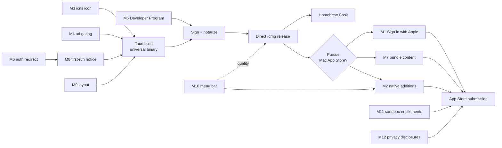

# macOS — Blockers and Fixes

Ordered remediation list. Every item names a **concrete file and symbol in the
`qlupala9p/udsp` repository**, a file the macOS host must add, or a specific
Apple Developer / App Store Connect action.

Severity key:

- **Blocker** — cannot ship on the affected channel without it.
- **High** — will fail for a large share of users, or blocks one channel.
- **Medium** — quality; fix before public launch.
- **Low** — polish and disclosure.

The **Channel** column matters more here than on any other track. macOS has two
distinct products — see [02-packaging-strategy.md](02-packaging-strategy.md).
Six of these twelve items exist **only** because of the Mac App Store, and
disappear entirely on the direct-download path.

| ID | Severity | Channel | Item | File / location |
| --- | --- | --- | --- | --- |
| M1 | Blocker | **MAS only** | Sign in with Apple required (4.8) | `firebase-client.js`, `profile.html` |
| M2 | Blocker | **MAS only** | Guideline 4.2 minimum functionality | host feature set |
| M3 | Blocker | Both | `.icns` app icon missing | `site.webmanifest` + new assets |
| M4 | Blocker | Both | AdSense inside a packaged app | all `*.html`, `shared.js` |
| M5 | Blocker | Both | No Apple Developer Program membership | Apple Developer |
| M6 | High | Both | `signInWithPopup` fails in `WKWebView` | `firebase-client.js` |
| M7 | High | **MAS only** | 2.4.5(iv)/(vii) — remote content and updates | host loading strategy |
| M8 | High | Both | Storage isolation looks like data loss | `bootstrap.js`, Firebase Console |
| M9 | Medium | Both | Desktop layout — **already fixed** | `bootstrap.js` |
| M10 | Medium | Both | No menu bar, ⌘ shortcuts, or window restoration | macOS host |
| M11 | Medium | Both | App Sandbox entitlements; `orientation` | host entitlements, `site.webmanifest` |
| M12 | Low | **MAS only** | Privacy manifest, labels, manifest metadata | new file, App Store Connect |

> **M3, M4, M6, and part of M11 are shared with the other tracks.** Fix each
> once, in the `udsp` repo, and every platform benefits. See
> [../android/03-blockers-and-fixes.md](../android/03-blockers-and-fixes.md)
> §B1, §B3, §B4, §B7 and
> [../windows/03-blockers-and-fixes.md](../windows/03-blockers-and-fixes.md)
> §W1, §W3, §W4, §W8; only the macOS deltas are given below.

---

## M1 — Sign in with Apple required *(Blocker — Mac App Store only)*

**Files:** `firebase-client.js` → `signIn()`, `profile.html`, Firebase Console,
Apple Developer portal

**Why it blocks:** Guideline **4.8 Login Services** requires that an app using a
third-party or social login service — Google Sign-In is named explicitly — to
set up or authenticate the user's primary account must **also** offer an
equivalent alternative that limits data collection to name and email, allows
the email to be kept private, and does not track users for advertising.

Sign in with Apple satisfies this. The app currently offers **Google only**, so
it fails as submitted. The listed exceptions — apps using exclusively the
developer's own account system, education or enterprise apps using an existing
institutional identity, and a few others — do not apply.

**This is the most expensive item in this document.** It is not host code; it
spans three systems:

1. **Apple Developer portal** — enable Sign in with Apple for the App ID,
   create a Services ID and a private key for the Firebase handshake.
2. **Firebase Console** — enable the Apple provider under Authentication, with
   the Services ID, Team ID, Key ID, and private key.
3. **`firebase-client.js`** — add a second provider path:

```js
const appleProvider = new firebase.auth.OAuthProvider('apple.com');
appleProvider.addScope('email');
appleProvider.addScope('name');
```

…plus a second button in `profile.html`, and account-linking logic for a user
who has already signed in with Google and later uses Apple with the same email.

**The private-relay trap.** Apple lets users hide their real address behind an
`@privaterelay.appleid.com` forwarding address, and **the display name is
supplied only on the very first authorisation** — it is never sent again. Any
logic that expects a stable, real email or a name on every sign-in will break
in ways that are hard to reproduce, because a second attempt with the same
Apple ID behaves differently from the first. Verify the Firestore profile write
handles both.

**Avoided entirely on the direct-download channel.** 4.8 is an App Store
guideline. This item is the single strongest argument for the sequencing in
[02-packaging-strategy.md](02-packaging-strategy.md).

---

## M2 — Guideline 4.2 minimum functionality *(Blocker — Mac App Store only)*

**Where:** host feature set

Analysed in full in [01-app-analysis.md](01-app-analysis.md) §4. Apple requires
an app to "include features, content, and UI that elevate it beyond a
repackaged website," and 4.2.2 explicitly names advertisements among the things
an app should not primarily consist of.

**Fix:** the native-additions table in §4 of the analysis. Its items are shared
with the Linux track's Flathub answer, so they are built once and satisfy two
gatekeepers:

| Addition | Shared with |
| --- | --- |
| Native menu bar with ⌘ accelerators | §M10 |
| Content bundled in-app, fully offline | §M7 |
| Native TTS via `AVSpeechSynthesizer` | Linux §L5 |
| Notification Centre streak reminders | Linux integration list |
| Dock badge showing daily progress | — |
| Native export/import via `NSSavePanel` | Linux XDG portal dialogs |
| Window restoration, live appearance following | §M10 |

**This item cannot be fully verified in advance.** It is a human judgement.
[01-app-analysis.md](01-app-analysis.md) §8 item 1 recommends testing the
reading before investing in the whole list, rather than building everything on
an assumption.

---

## M3 — `.icns` app icon missing *(Blocker — both channels)*

**File:** `site.webmanifest`, plus new assets

Shared with Android B1, Windows W1, and Linux L2. The manifest declares only
`icon.svg`, and macOS needs an `.icns` bundle containing 16, 32, 128, 256, and
512 pt variants at both 1× and 2×, up to 1024×1024.

`cargo tauri icon icon.svg` generates the whole set. Alternatively, build an
`AppIcon.iconset` directory and run `iconutil -c icns AppIcon.iconset`.

**macOS-specific note:** Apple's icon design language expects a rounded-rect
"squircle" silhouette with consistent padding, not a full-bleed square. An icon
that ignores this looks visibly foreign in the Dock beside every other app —
and appearance is a live input to the §M2 judgement. The existing `icon.svg` is
a good vector source, but it likely needs macOS-specific framing rather than a
straight rasterisation.

---

## M4 — AdSense inside a packaged app *(Blocker — both channels)*

**Files:** all `*.html`, `shared.js`

Shared with Android B4, Windows W4, and Linux L3. The underlying risk is
identical and is not repeated: AdSense is a *website* product being served
inside an application surface, which puts the AdSense account funding the
website at risk.

**macOS escalates it in one specific way.** Guideline 4.2.2 names
advertisements directly, so on the Mac App Store this is not only an AdSense
terms problem but a review problem — a reviewer will see the ads. And unlike
the automated checks on other platforms, a human notices context.

Port the Windows host's network-layer block: requests matching
`AppConfig.BlockedResourcePatterns` return HTTP 204. That is belt-and-braces;
it does not remove the need for the upstream app-context gate, since the
scripts remain referenced in the HTML and a reviewer may read the page source.

---

## M5 — No Apple Developer Program membership *(Blocker — both channels)*

**Where:** <https://developer.apple.com/programs/>

**$99/yr, and it gates everything.** A free Apple ID cannot issue a Developer
ID certificate, cannot notarize, and cannot submit to the App Store. Without
it, a downloaded app is blocked by Gatekeeper with a message most users read as
"this app is broken."

Enrolment is **not instant** — identity verification takes days, and longer for
organisations, which additionally need a D-U-N-S number. Start this before it
is on the critical path.

| Certificate | Channel | Note |
| --- | --- | --- |
| Developer ID Application | Direct `.dmg` | Signs the app for notarization |
| Developer ID Installer | Direct `.pkg` | Only if a `.pkg` is used instead of a `.dmg` |
| Mac App Distribution | Mac App Store | A **different** certificate |
| Mac Installer Distribution | Mac App Store | Signs the uploaded package |

Decide the channel before generating certificates. Using the wrong one fails
late — typically at notarization or upload, after every earlier step reported
success.

An **app-specific password** or an App Store Connect API key is also needed for
`notarytool`; the plain Apple ID password does not work.

---

## M6 — `signInWithPopup` fails in `WKWebView` *(High — both channels)*

**File:** `firebase-client.js` → `signIn()`

Shared with Android B3, Windows W3, and Linux L4. In a Tauri host, `window.open`
has no default handler, so the Firebase popup flow never opens a window and
sign-in silently does nothing.

Beyond the technical failure, Google has for years restricted OAuth in embedded
web views, returning `disallowed_useragent` for flows it identifies as
embedded. A popup inside `WKWebView` is exactly that shape.

**Fixes, in order of preference:**

1. **`signInWithRedirect` + `getRedirectResult`** in packaged contexts — the
   shared fix already specified for three other platforms, so it costs nothing
   extra here.
2. **`ASWebAuthenticationSession`** — the correct native macOS mechanism for
   OAuth. Presents a system-managed Safari sheet, shares Safari's cookie jar,
   and is explicitly the pattern Apple and Google both expect. More host code,
   but the most native result and the strongest position under §M2.
3. Host-handled popup window, mirroring the Windows implementation.

Option 1 for parity, option 2 if the Mac App Store is pursued — a reviewer
seeing `ASWebAuthenticationSession` sees an app that integrates with the
platform rather than reimplementing it.

**Note the interaction with §M1.** Whatever mechanism is chosen must work for
both Google *and* Apple providers on the App Store channel.

---

## M7 — Remote content versus 2.4.5 *(High — Mac App Store only)*

**Where:** host loading strategy

Guideline **2.4.5(iv)** states that a Mac App Store app "may not download or
install standalone apps, kexts, additional code, or resources to add
functionality or significantly change the app from what we see during the
review process," and **2.4.5(vii)** that "they must use the Mac App Store to
distribute updates; other update mechanisms are not allowed."

A host that fetches its entire UI, all game logic, and all data from a web
server at launch is in obvious tension with both. What the reviewer sees is
whatever the site served that day, and every subsequent deploy changes the app
without review.

**Fix: bundle the web content in the app for the Mac App Store build.** Ship
the HTML, CSS, JS, and `data/` inside the `.app` and load from the local
scheme. Three consequences follow, and all three need planning:

1. **The service worker stops registering.** `WKWebView` does not register
   service workers on custom schemes. This is survivable — `sw.js` is purely a
   cache layer and bundled content needs no cache — but the `/data/*` 24-hour
   refresh becomes dead code and offline behaviour must be re-verified rather
   than assumed.
2. **The bundle grows by roughly 36 MB.** Acceptable for a desktop app, but it
   makes the download disclosure in **4.2.3(ii)** relevant: *"If your app needs
   to download additional resources in order to function on initial launch,
   disclose the size of the download and prompt users before doing so."* If any
   data is fetched after launch rather than bundled, it must be disclosed and
   prompted for.
3. **The origin changes**, which breaks Firebase auth until the new origin is
   added to authorized domains — see §M8.

**Content updates then require a new submission.** That is the operating cost
flagged in [02-packaging-strategy.md](02-packaging-strategy.md) §1, and it is
the strongest single argument for the direct-download channel, where none of
this applies and the host can keep loading the live site.

---

## M8 — Storage isolation and Firebase authorized domains *(High — both)*

**Files:** `bootstrap.js` first-run notice, Firebase Console

Shared with Windows W5/W6 and Linux L7. The packaged app has its own
`WKWebView` data store, so a user arriving from the website sees a zeroed
streak, no known words, no favourites, and no game bests. Under the App Sandbox
the data lives in `~/Library/Containers/<bundle-id>/` and is removed with the
app.

`bootstrap.js` already contains the first-run notice written for the Windows
track and needs no change.

**Two macOS-specific checks:**

1. **Confirm the data store is persistent.** An ephemeral `WKWebView` store
   discards `localStorage` on every quit. That would look like total data loss
   and is trivially easy to introduce by accident.
2. **Add the packaged origin to Firebase authorized domains.** If the host
   loads the live site this is already `udsp.vercel.app`. If §M7 is
   implemented, the origin becomes a local scheme and sign-in fails with
   `auth/unauthorized-domain` — an error that gives no hint about its cause.

---

## M9 — Desktop layout *(Medium — both channels)* — **already fixed**

**File:** `windows/src/TopWords.Windows/Scripts/bootstrap.js` (shared)

Shared with Windows W7 and Linux L8. The site's app shell is declared only
inside `@media (max-width: 720px)`; above that width the whole page scrolls and
the header and navigation scroll away with it. `bootstrap.js` re-applies the
shell at `@media (min-width: 721px)`.

The file is plain JavaScript with no host bindings and is injected on macOS the
same way it is everywhere else. Measured on Windows at 1000×800, page height ÷
viewport went from 2.21×–451.95× to **1.00× on every page**.

**The Linux `:has()` caveat is much weaker here.** `WKWebView` ships with the
OS rather than with a distribution, so the floor is whatever macOS version is
supported rather than whatever the user happened to install. Still verify
against the oldest supported macOS, but the fallback in
[../linux/03-blockers-and-fixes.md](../linux/03-blockers-and-fixes.md) §L8 is
unlikely to be needed.

---

## M10 — No menu bar, ⌘ shortcuts, or window restoration *(Medium — both)*

**Where:** macOS host

The conventions table in [01-app-analysis.md](01-app-analysis.md) §7 lists what
is expected. None of it exists today.

This is nominally a Medium quality item, but it is **direct input to the §M2
judgement**. An app with no menu bar, where ⌘C does nothing and ⌘Q behaves like
closing a window, reads as a web page in a frame regardless of how substantial
its content is. On the App Store channel, treat this as effectively High.

Implement via the Tauri menu API. Minimum viable set:

- **App menu**: About, Settings (⌘,), Hide, Quit (⌘Q)
- **File**: Close Window (⌘W), Export Progress…
- **Edit**: Undo, Redo, Cut, Copy, Paste, Select All — **wired to the web
  view**, not stubs
- **View**: sections ⌘1…⌘5, Enter Full Screen
- **Window**: Minimize, Zoom
- **Help**: Top Words Help, Privacy Policy

The Edit menu is the most commonly forgotten and the most quickly noticed —
without it, ⌘C does nothing anywhere in the app.

---

## M11 — App Sandbox entitlements; `orientation` *(Medium — both)*

**Files:** host entitlements, `site.webmanifest`

**Entitlements.** The Hardened Runtime is required for notarization on both
channels; the App Sandbox is required by **2.4.5(i)** for the App Store only.
The minimum set:

| Entitlement | Needed for |
| --- | --- |
| `com.apple.security.app-sandbox` | Mac App Store — mandatory |
| `com.apple.security.network.client` | Outbound HTTPS to the site, Firebase, and Firestore |
| `com.apple.security.files.user-selected.read-write` | Only if progress export is added |

Do **not** add entitlements speculatively. Each one is something a reviewer can
ask about, and unjustified entitlements attract questions. In particular, this
app has no need for `com.apple.security.cs.allow-unsigned-executable-memory` —
`WKWebView` runs its JIT in a separate system-provided process.

**`orientation`.** `site.webmanifest` declares `"orientation":
"portrait-primary"`, meaningless on a desktop and a signal to tooling that the
app is phone-only. Change to `"any"`. Shared with Android B7, Windows W8, and
Linux L11 — one edit covers all four.

---

## M12 — Privacy manifest, labels, and manifest metadata *(Low — MAS only)*

**Files:** new `PrivacyInfo.xcprivacy`, App Store Connect, `site.webmanifest`

Three disclosure items grouped together. None is difficult; all are easy to
forget until they block a submission.

1. **`PrivacyInfo.xcprivacy`** — a privacy manifest declaring collected data
   types and any required-reason API use. Apple's tooling flags a missing one
   at upload.
2. **App Store privacy labels** — completed in App Store Connect. The app
   collects email address, display name, profile photo URL, and user ID via
   Firebase Auth, plus study progress in Firestore. **These answers must match
   the Play Data Safety declarations**; two store listings contradicting each
   other about the same app is a bad look and an easy question to be asked.
3. **Manifest `id`, `screenshots`, `shortcuts`** — shared with Android B8/B10
   and Windows W11. Low value on macOS specifically, but the edit is free once
   it is being made for the other tracks.

**Account deletion is already handled.** Guideline **5.1.1(v)** requires an
in-app account deletion path, and `deleteAccountAndProfile()` already exists.
This is worth noting because it is a common rejection cause that this app
happens to have solved already.

---

## Suggested fix order

The two channels diverge early. Everything on the left is needed for any macOS
release; the right-hand branch exists only for the App Store.



**M5 must come first in wall-clock terms.** Apple Developer Program enrolment
involves identity verification that takes days, and nothing can be signed,
notarized, or submitted until it completes. Start it before it blocks anything
else.

**The `GATE` decision should be made deliberately and late** — after the direct
build ships and there is real evidence about macOS demand. Four of the twelve
items here exist only beyond that gate, and they are the four most expensive.
