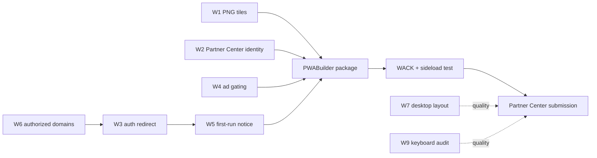

# Windows — Blockers and Fixes

Ordered remediation list. Every item names a **concrete file and symbol in the
`qlupala9p/udsp` repository**, or a specific Partner Center / PWABuilder action.

Severity key:

- **Blocker** — cannot produce a submittable MSIX without it.
- **High** — will fail certification, or will fail for a large share of users.
- **Medium** — quality; fix before public launch.
- **Low** — polish.

| ID | Severity | Item | File / location |
| --- | --- | --- | --- |
| W1 | Blocker | PNG tile asset set missing | `site.webmanifest` + new PNGs |
| W2 | Blocker | Package identity not reserved / not baked in | Partner Center + PWABuilder |
| W3 | Blocker | `signInWithPopup` unreliable in WebView2 | `firebase-client.js` |
| W4 | Blocker | AdSense inside a packaged app | all `*.html`, `shared.js` |
| W5 | High | Storage isolation looks like data loss | `shared.js` / `home.js` first-run UX |
| W6 | High | Firebase authorized domains missing packaged origin | Firebase Console |
| W7 | Medium | Mobile-first layout on desktop — **fixed in host** | `styles.css` |
| W8 | Medium | `orientation: portrait-primary` | `site.webmanifest` |
| W9 | Medium | Keyboard accessibility unaudited | all pages |
| W10 | Low | Window size not declared | PWABuilder config |
| W11 | Low | Manifest `id`, `screenshots`, `shortcuts` | `site.webmanifest` |

> **W1, W3, and W4 are shared with the Android track.** Fix each once, in the
> `udsp` repo, and both stores benefit. See
> [../android/03-blockers-and-fixes.md](../android/03-blockers-and-fixes.md)
> §B1, §B3, §B4 for the full treatment; the Windows-specific deltas are noted
> below rather than repeated.

---

## W1 — PNG tile asset set missing *(Blocker)*

**File:** `site.webmanifest`, plus new PNG assets

**Why it blocks:** MSIX requires a specific set of raster tile assets. SVG is
not accepted anywhere in the Windows asset pipeline. The manifest currently
declares only `icon.svg`.

Windows needs, at minimum:

| Asset | Purpose |
| --- | --- |
| `Square44x44Logo` | Taskbar, Start list view, app list |
| `Square150x150Logo` | Medium Start tile |
| `Wide310x150Logo` | Wide Start tile |
| `StoreLogo` (50×50) | Store listing and installer |
| `Square71x71`, `Square310x310` | Small and large Start tiles |
| Scale variants | 100/125/150/200/400 % for each of the above |
| Target-size variants | 16/24/32/48/256 px for `Square44x44` |

**Fix:** this is a superset of the Android requirement, so do W1 and Android's
B1 together.

1. Add the PNG entries described in Android B1 (192, 512, maskable 512) to
   `site.webmanifest` — PWABuilder reads the manifest to seed generation.
2. Use the **PWABuilder Image Generator** (or `npx pwa-asset-generator`) to
   produce the full Windows tile matrix from `icon.svg` at high resolution.
3. Use `#0f172a` as the background — it matches `theme_color` and
   `background_color`, so the splash and tiles stay visually consistent.

**Do not** hand-author these. The scale and target-size matrix is large and
WACK will flag any missing entry.

---

## W2 — Package identity not reserved *(Blocker)*

**Where:** Partner Center → Product → Product identity; then PWABuilder

**Why it blocks:** an MSIX carries a cryptographic identity that must match the
app reservation in Partner Center exactly. **This is the single most common
cause of MSIX submission rejection.**

Three values must be copied verbatim from Partner Center into PWABuilder before
generating the package:

| Value | Example shape | Where it comes from |
| --- | --- | --- |
| **Package identity Name** | `12345Publisher.TopWords` | Partner Center product identity page |
| **Publisher** | `CN=ABCDEF12-3456-...` | Partner Center — a GUID-form CN, **not** a human name |
| **Publisher display name** | `Top Words` | Partner Center |

**Fix, in order:**

1. Create the Partner Center account (see
   [04-release-runbook.md](04-release-runbook.md) §1).
2. **Reserve the app name first.** This creates the identity values.
3. Copy all three values into the PWABuilder Windows options.
4. Generate the Store-ready package.

Reversing steps 2 and 3 — generating a package before reserving the name —
guarantees a rejection and a wasted review cycle. The `Publisher` value in
particular is a GUID-form distinguished name that cannot be guessed.

---

## W3 — `signInWithPopup` in WebView2 *(Blocker)*

**File:** `firebase-client.js`, function `signIn(providerId)`

Same root cause as Android B3, different failure mode. In WebView2 the popup
*may* open, but Firebase's `postMessage` handshake back to the opener is
unreliable in a packaged app window, and the popup can be left orphaned with no
way to close it.

**Fix:** apply the identical change described in
[../android/03-blockers-and-fixes.md](../android/03-blockers-and-fixes.md) §B3 —
branch to `signInWithRedirect` when `TWApp.isPackaged()` is true, extract
`afterSignIn()`, and handle `getRedirectResult()` at init.

**The `afterSignIn` extraction matters more here than on Android.** Because of
W5 (storage isolation), a Windows user signing in for the first time is
*specifically* trying to recover progress from another device. If the
post-redirect handler is missing, the cloud profile is never read, and the user
concludes the sync feature is broken.

**Windows-specific detection:** the `isMsix()` branch in the `TWApp` helper
checks for the ` MSAppHost/` token in the user agent and the `ms-appx-web:`
protocol. Verify empirically which applies to a PWABuilder-generated package —
it depends on whether the package uses a hosted or local start URL. Log
`navigator.userAgent` from inside a sideloaded build and confirm before relying
on it.

---

## W4 — AdSense inside a packaged app *(Blocker)*

**Files:** `<head>` of all `*.html`; `shared.js`

Same fix as Android B4, but the policy position is **less ambiguous here**. An
Android TWA at least renders in the user's Chrome browser against a URL the
AdSense account owns. An MSIX is a self-contained application package
distributed through a third-party store — there is no reasonable reading under
which that is a website.

Apply the `TWApp` helper and conditional script injection from
[../android/03-blockers-and-fixes.md](../android/03-blockers-and-fixes.md) §B4,
and ensure `isMsix()` returns true for the packaged build before submitting.

Microsoft Store submission also requires declaring whether the app contains
ads. Gating the script makes that declaration truthful.

---

## W5 — Storage isolation looks like data loss *(High)*

**Files:** `shared.js` or `home.js` first-run path

**Why it matters:** the MSIX gets its own storage partition. A user who studied
on the website in Edge installs the Store app and finds streak 0, no known
words, no favourites, no best scores. See
[01-app-analysis.md](01-app-analysis.md) §5.

**Fix:** on first run in a packaged build, show a one-time notice with a direct
route to sign-in:

```js
// on home.html, first run only
if (window.TWApp && window.TWApp.isPackaged()) {
  var seen = localStorage.getItem("udsp_firstrun_notice_v1");
  var hasProgress = Object.keys(lsGet("udsp_known_v1", {})).length > 0;
  if (!seen && !hasProgress) {
    // "Web sitesindeki ilerlemen bu uygulamaya otomatik aktarılmaz.
    //  Giriş yaparak buluttan geri yükleyebilirsin."
    // -> button linking to profile.html
    localStorage.setItem("udsp_firstrun_notice_v1", "1");
  }
}
```

Gate on `!hasProgress` so returning users are never shown it.

This depends on W3 being fixed first — pointing users at a sign-in flow that
does not work is worse than saying nothing.

---

## W6 — Firebase authorized domains *(High)*

**Where:** Firebase Console → Authentication → Settings → Authorized domains

The packaged app's effective origin must be present, or the redirect flow from
W3 fails with `auth/unauthorized-domain`.

**Fix:** add the production domain (and the custom auth domain, if adopted per
Android B5). Determine the packaged app's actual origin empirically from a
sideloaded build — log `location.origin` — rather than assuming.

---

## W7 — Mobile-first layout on desktop *(Medium)* — **FIXED in the host**

**File:** `styles.css` (upstream) · fixed from
`windows/src/TopWords.Windows/Scripts/bootstrap.js`

### What was actually wrong

The original note here assumed the problem was a phone UI stretched wide, to be
solved with a `max-width`. Measuring the real pages showed something different
and considerably worse.

`styles.css` contains **only `max-width` breakpoints** — the largest is 720 px.
Inside `@media (max-width: 720px)` the site builds a genuine app shell:

```css
body      { height: 100svh; overflow: hidden; }   /* page never scrolls   */
.container{ flex: 1 1 auto; min-height: 0; overflow-y: auto; }
.site-header { position: sticky; top: 0; }        /* header + nav pinned  */
.site-footer { display: none; }
```

Above 720 px none of that applies, so the desktop window falls back to plain
document flow: the **whole page scrolls, carrying the header and the nav bar
off-screen**, and a tall block of crawler-facing `.seo-content` trails every
page. The app window is 1000 px wide, so it always landed in the broken mode.

Measured with `tools/TopWords.SelfTest` at 1000×800, as page height ÷ viewport:

| Page | Before | After |
|---|---:|---:|
| `/` (cards) | 2.21× | 1.00× |
| `/quiz.html` | 4.86× | 1.00× |
| `/about.html` | 4.75× | 1.00× |
| `/help.html` | 17.16× | 1.00× |
| `/wordlist.html` | 451.95× | 1.00× |

### The fix

`bootstrap.js` re-applies the shell at `@media (min-width: 721px)` — the site's
own layout, just ungated. It takes only the **structural** rules; the phone
*sizing* rules in that block (shrunken fonts, hidden button labels, tightened
padding) are deliberately not copied. It also:

- raises `--maxw` from 760 px to 1040 px, so the window's full width is used —
  every grid on the site is `auto-fill`, so they gain columns and lose rows for
  free (`.stats-grid` 310 px → 159 px);
- hides `.seo-content`, but only via
  `.container:has(.view.is-active) .seo-content`, so About and Help — whose real
  content *is* prose — keep theirs.

The 721 px floor meets the site's own 720 px ceiling exactly, so there is no
width with two layouts or none.

> This is a host-side injection, so it needs no change to `qlupala9p/udsp`.
> It is still worth upstreaming into `styles.css`, since the desktop **web**
> experience has exactly the same defect.

Verify the games in particular — `matrix.js` and `memory.js` render grids that
may stretch badly without a container constraint.

---

## W8 — `orientation: portrait-primary` *(Medium)*

**File:** `site.webmanifest`

Meaningless on desktop at best, and it signals to tooling that the app is
phone-only. Change to `"any"`. Shared with Android B7 — one edit covers both.

---

## W9 — Keyboard accessibility unaudited *(Medium)*

**Files:** all pages

The app already supports Space to flip and arrow keys to advance, which is
better than most PWAs. But desktop users navigate by keyboard far more than
mobile users, and Store accessibility expectations are correspondingly higher.

**Audit for:** focus reachability of `.bottom-nav` items, `#more-btn` and the
`.more-sheet` contents, `#category-btn` (which declares
`aria-haspopup="dialog"` — verify focus is trapped and `Esc` closes),
`.select-pill` dropdowns, and every game's interactive elements. Confirm a
visible focus indicator exists in both themes.

---

## W10 — Window size not declared *(Low)*

**Where:** PWABuilder Windows options

Set an initial window of roughly **1000×800** with a minimum near 360×640.
Accepting the default risks launching maximised into the W7 layout problems.

---

## W11 — Manifest `id`, `screenshots`, `shortcuts` *(Low)*

**File:** `site.webmanifest`

Shared with Android B8 and B10. `shortcuts` additionally surface as **Windows
jump list entries** on the taskbar, which is a genuine desktop nicety —
Flashcards, Quiz, Games.

Note that manifest `screenshots` are distinct from Store listing screenshots,
which have their own size requirements — see
[04-release-runbook.md](04-release-runbook.md) §5.

---

## Suggested fix order



**W2 must come first in wall-clock terms** — the Partner Center account and name
reservation gate everything else, and account verification is not instant.
